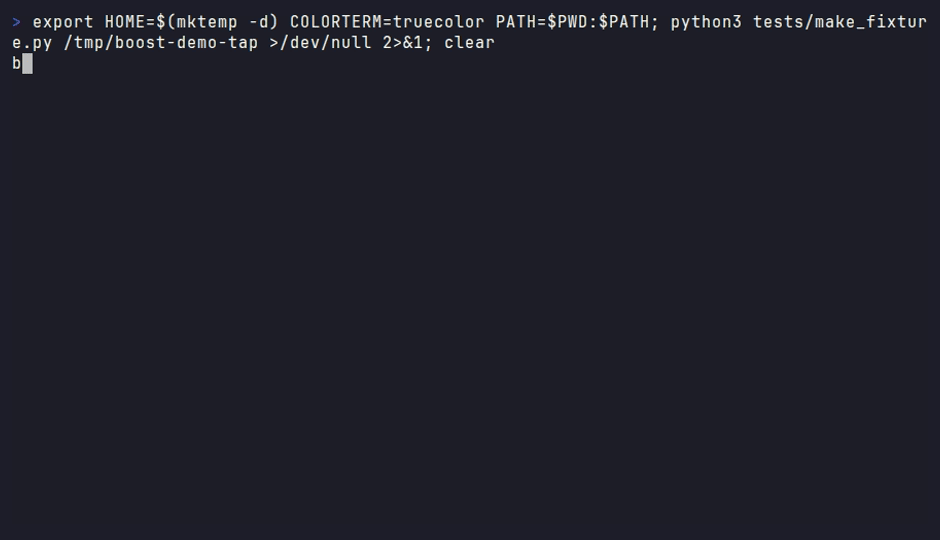

# boost — a package manager for AI coding skills

[](https://github.com/jonnyeclectic/boost/actions/workflows/ci.yml)
[](https://github.com/jonnyeclectic/boost/releases/latest)
[](https://github.com/jonnyeclectic/boost/blob/main/.github/workflows/ci.yml)
[](https://github.com/jonnyeclectic/boost/actions/workflows/ci.yml)
[](https://github.com/jonnyeclectic/boost/blob/main/scripts/mutation_gate.py)
[](https://github.com/jonnyeclectic/boost/actions/workflows/ci.yml)
[](https://www.bestpractices.dev/projects/14275)
[](https://www.bestpractices.dev/projects/14275/baseline-2)
[](LICENSE)

**Homebrew for AI coding skills.** boost finds, installs, and version-tracks skills
from GitHub-hosted registries, and wires each one into Claude Code, Windsurf,
Cursor and Gemini CLI in a single pass.

```bash
pipx install boost-skill-cli
boost quickstart              # taps the 7 starter registries, loads prebuilt vectors
boost search tdd              # keyword + semantic, fused
boost install tdd-workflow    # → every agent, version-pinned, one lock file
```

(No `pipx` yet? macOS ships neither it nor a new enough Python — run the
[prerequisites check](#prerequisites) first.)

No more copying `SKILL.md` into four agent folders and forgetting which one is
stale. The default install is pure stdlib, with no build step and no
dependencies.

<p align="center">
  
  <br>
  <sub><em>tap a registry → search → install into every agent → doctor — one flow</em></sub>
</p>

## What's a skill, exactly?

A skill is a `SKILL.md` file: Markdown plus a bit of YAML up top, giving an
agent a repeatable capability. A workflow to follow, a set of house rules, or
domain knowledge it wouldn't otherwise have. Agents like Claude Code pick these
up automatically out of `~/.claude/skills/`.

The tedious part is everything around that file: finding good skills, wiring
each one into every agent you use, keeping versions in sync, and handing them
to teammates. That is what boost takes over.

## Prerequisites

boost needs **Python 3.12+**, **git** and **pipx**. macOS ships `git`, but its
`python3` is 3.9 and it has no `pipx` — which is why `pipx install
boost-skill-cli` fails with `command not found` on a new machine.

Check before you install — each line prints `ok`, or what is missing:

```bash
python3 -c 'import sys; v=sys.version.split()[0]; print("python ok", v) if sys.version_info >= (3,12) else print("python TOO OLD", v)'
command -v git  >/dev/null && echo "git ok"  || echo "git MISSING"
command -v pipx >/dev/null && echo "pipx ok" || echo "pipx MISSING"
```

Install only what the check flagged — on macOS:

```bash
brew install python@3.13     # only if the check said python TOO OLD
brew install git             # only if it said git MISSING
brew install pipx            # only if it said pipx MISSING
pipx ensurepath
exec $SHELL -l
```

On Debian/Ubuntu: `sudo apt install python3.13 git pipx`, then the same
`pipx ensurepath` and new shell. If `ensurepath` answers `All pipx binary
directories have been appended to PATH ... try again with the '--force' flag`,
that is it reporting the PATH is already set up — you are done, and `--force`
is not what you want. `ensurepath` puts `~/.local/bin` on your PATH
and the fresh shell is what makes that take effect — skipping it is the other
way to end up at `boost: command not found`.

## Install

```bash
pipx install boost-skill-cli
boost --version
boost tap --defaults
```

`pipx` keeps boost in its own isolated environment, which is why it is the recommended
route. Without pipx, use an explicit interpreter — a bare `pip` is often absent
or points at the wrong Python:

```bash
python3.13 -m pip install --user boost-skill-cli
```

If `boost: command not found` after a successful install, the install directory
is not on your PATH: run `pipx ensurepath` — or, for a `--user` pip install, add
the `bin` under `python3.13 -m site --user-base` — and reopen the shell.

Upgrading later is one command, whichever way you installed:

```bash
boost self-update             # detects pipx / pip / uv / a git checkout and drives it
boost self-update --dry-run   # print the command it would run, change nothing
```

It reads evidence on disk — `.git`, then `pipx_metadata.json` or `uv-receipt.toml`,
then installed package metadata — and for a pip install runs `sys.executable -m pip`
rather than a bare `pip`, which can belong to a different interpreter and would
upgrade a different copy while reporting success.

By hand it is `upgrade`, not `install --upgrade`: with a bare package name the
latter matches the spec you already satisfy and silently does nothing.

```bash
pipx upgrade boost-skill-cli        # or: python3.13 -m pip install --user --upgrade boost-skill-cli
```

Or run it from a checkout. The runtime is stdlib-only, so there is nothing to
install beyond the shim:

```bash
git clone https://github.com/jonnyeclectic/boost ~/.boost-src
ln -s ~/.boost-src/boost ~/bin/boost        # anywhere on PATH works
```

## Search

`boost search` ranks with a built-in full-content BM25 engine. The index builds
itself on your first search, so there is nothing to set up.

BM25 matches words, which fails when your query shares no vocabulary with the
skill you want. Semantic search fixes that and needs no API key — only the
extra:

```bash
pipx inject boost-skill-cli "boost-skill-cli[rag]"   # pip install "boost-skill-cli[rag]" if you used pip
boost quickstart                                     # downloads prebuilt vectors
```

`boost quickstart` is the fast path: it taps the starter registries **pinned to
the commits the published vectors were built from**, then downloads and imports
those vectors. Embedding is ~1.2 s/chunk on CPU — hours for a real corpus —
and importing the same rows takes 0.12 s, so the difference between the two is
the difference between semantic search being available and being reachable.

Want everything? `boost quickstart --catalog` taps all 463 catalogued
registries — 2 min 10 s now that clones run in parallel — and fetches vectors
for every one that has a published shard.

Already tapped? `boost reindex --fetch-shards` does the download half alone,
and `boost reindex --dense` embeds locally whatever has no published shard.
Every download is checked against the sha256 in the manifest and refused on a
mismatch, and shards for a registry that has moved since publication are
refused rather than merged — stale vectors would otherwise look fresh forever.

When both indexes exist boost fuses the rankings rather than choosing between
them. See [docs/semantic-search.md](docs/semantic-search.md) for the whole
setup, what it costs, and how to tell which engine is actually serving.

## The registry catalog

`boost tap --defaults` gives you seven registries. The full catalog is 480+
classified GitHub registries of skills, Cursor/Windsurf rules and Claude Code
workflows, indexing roughly 30,000 items.

```bash
boost tap --catalog --dry-run                 # browse the classified catalog
boost tap --catalog --type skill --limit 20   # the 20 biggest skill packs
boost tap --catalog --category infra          # Docker/Kubernetes/OpenShift packs
boost tap --catalog --category java           # Spring Boot / Kotlin / JVM packs
boost tap --catalog --category security       # filter by category
```

Taps clone in parallel — eight at once by default, `--jobs N` (or
`BOOST_TAP_JOBS`) to change it, capped at 16 because it is someone else's
server. A clone is network latency rather than bandwidth, so the whole catalog
measures **2 min 10 s for 463 registries** where one-at-a-time took 13 minutes.

Every `est_items` is measured from the repository's file tree rather than
estimated, so `--limit` ranks by real size. Items are counted once however many
agents a repository renders them for, so a pack shipping a copy in `.claude/`,
`.cursor/` and twelve other dotdirs is not credited with fourteen skills.

Seven domains are curated end to end and each is tappable on its own: `ai`,
`architecture`, `ui`, `java`, `ecommerce`, `infra` and `marketing`. Smaller
categories fill in around them.

One of those deserves a note. `efficiency` collects packs whose items exist to
make an agent emit less: less code (`ponytail`) or fewer output tokens
(`caveman`). Their `focus` lines describe what the items do and omit the
headline savings on purpose. Independent paired benchmarks reproduce roughly a
fifth of what each advertises, with no measured quality loss, so the effects are
real but much smaller than the marketing figure.

### Share the catalogue instead of re-tapping it

Tapping is the slowest thing a new install does, and the expensive artifact is
not the valuable one. On a machine with 458 registries tapped the shallow clones
are 12 GB, while the catalogue they produce is 10.9 MB gzipped. So hand someone
the catalogue:

```bash
boost catalog --export catalogue.tgz    # 458 taps · 59,972 entries · 10.9 MB
boost catalog --show catalogue.tgz      # what is in it, without importing
boost catalog --import catalogue.tgz    # on the other machine
```

Measured on a fresh `HOME`: import takes 0.3 s, `boost reindex` a further 3.8 s,
and `boost search` then returns real hits over all 59,972 items with zero
repositories cloned. `install` still clones, but only the one registry your
chosen skill lives in.

Bundles carry catalogue JSON and nothing else. Derived indexes are excluded
because they rebuild in seconds, and vectors because they are only valid inside
the embedding space that made them. Import merges, so it never drops taps the
receiving machine already had.

## Under the hood

```text
GitHub registries  ──boost update──▶  ~/.boost/repos/    (blobless sparse clones)
                                     ~/.boost/cache/    (JSON catalogs)
                   ──boost install─▶  ~/.agents/skills/ (canonical store)
                                     .skill-lock.json  (v3 lock file)
                   ────symlinks───▶  ~/.claude/skills/  ~/.windsurf/skills/  ~/.cursor/skills/
```

A tap clone holds only the files boost indexes: `SKILL.md`, workflow Markdown
and rule files. Everything else a registry ships is neither downloaded nor
checked out. `Shopify/agent-skills` is 611 MB as a normal clone and 11 MB as a
tap, and produces an identical catalog. When a skill you install owns its own
`scripts/` or `assets/`, those are fetched on demand at install time.

If you tapped heavily before this landed, `boost compact` narrows the clones you
already have, offline and with no loss of search coverage:

```bash
boost compact --dry-run     # what it would reclaim
boost compact               # narrow every clone in place
boost compact --reclone     # also drop downloaded git objects (needs network)
```

boost indexes three item kinds from the same registries, and they install to
different places. A skill is copied into the canonical store and symlinked out.
A rule is materialised into each agent's context file (`~/.claude/CLAUDE.md`,
`~/.gemini/GEMINI.md`), so it has no directory to look in. A workflow is
rendered per agent.

```bash
boost list --kind rule                # just the rules, and where they landed
boost list --kind workflow            # and which slot each one fills
```

Gemini CLI is the one agent that needs no symlink. It implements the
[Agent Skills](https://agentskills.io) standard and discovers `~/.agents/skills`
directly, so linking into `~/.gemini/skills` as well would put the same skill in
two of its discovery tiers. Rules and workflows still materialize under
`~/.gemini/`.

## User scope vs project scope

The default is user scope: the skills you want everywhere. The other half is the
npm `--save` half, for skills a team agrees on, which belong in the repository
where they can be reviewed in a PR and arrive with a `git clone`.

```bash
boost install code-review --local     # into THIS repo (= --scope project)
boost install code-review             # into your user config (default)
boost list --local                    # just what this repo carries
boost uninstall code-review --local
```

A `--local` install writes real directories into the repository's own agent
config and records them in a committable per-repo lock:

```text
<repo>/.claude/skills/<name>/     real copies, not symlinks
<repo>/.cursor/skills/<name>/
<repo>/.boost/skill-lock.json     commit this — it's what teammates clone
```

Real copies, deliberately: a symlink into your `~/.agents/skills` is a dangling
pointer on anyone else's machine. The two scopes use separate lock files, so
vendoring a skill into a repository never fights with the copy you use
everywhere, and `boost install --local` run from `src/deep/nested` walks up to
the repository root rather than scattering a `.claude/` three directories down.

After a fresh clone, `boost sync` re-materializes anything the project lock
records but the checkout is missing. It never deletes a skill directory boost
didn't write, and won't overwrite a hand-written `.claude/skills/<name>/`
without `--force`.

`boost update` covers user scope only for now. To refresh a vendored skill, use
`boost install <skill> --local --force`.

## The usual workflow

```bash
boost search jira          # look across every tapped registry
boost install my-jira      # copy, link, lock — with a quality score attached
boost doctor               # broken links, lock drift, stale taps

# hand the whole setup to a team:
boost bundle dump > Boostfile     # everyone else runs: boost bundle install
```

## Browsing the catalogue

`boost browse` is a full-screen picker over every tapped item: a filterable list
on the left, the selected item's detail on the right.

```text
╭─ ●●●  boost browse  ──────────────────────────────────┬──────────────────────╮
│ ❯ co re                                          2/4  │ code-review  v1.0.0  │
│ match (●) all ( ) name ( ) descr ( ) tap              │ ──────────────────── │
│ ↑↓ move  ⇥ select  → detail  ^T scope  ↵ install      │ Review a pull …      │
├───────────────────────────────────────────────────────┤ ● installed          │
│  ★● code-review         [skill] v1.0.0 [acme/quality] │ SOURCE · FRONTMATTER │
╰─ ✓ 1 installed ───────────────────────────────────────┴──────────────────────╯
```

| key | does |
|---|---|
| any character, including space | types into the query |
| `↑` `↓` | walk the whole surface: query → match toggles → results |
| `→` `←` | into and out of the detail pane, where `↑`/`↓` scroll it |
| `⇥` | select, and multi-select for a batch install |
| `^T` | cycle the match toggles without leaving the results |
| `↵` | install, in place, without leaving the browser |
| `esc` | quit |

The query splits on spaces and every token must match, so `code review` narrows
where `code` alone would not. Selection lives on `⇥` rather than space for
exactly that reason, and `q` stays a character so `quality` is searchable.

Duplicates are collapsed. Registries render one skill into `.claude/`,
`.cursor/`, `.gemini/` and a plugin root, so on a real 60,047-entry catalogue
22,535 rows (37%) are duplicates. Rows whose name and description match, or are
at least 95% alike, fold into one badged `×5`, with `^D` to show them again.
Identity is the description and never the name: `code-reviewer` appears 75 times
with 42 different descriptions, and those are 42 real skills.

## 81 commands, organized into 8 groups

`boost --help` prints the full grouped list. For every flag of every command see
[`docs/commands.html`](docs/commands.html); for a visual tour,
[`docs/index.html`](docs/index.html); for how boost is put together internally,
the C4 diagrams in [`docs/architecture/`](docs/architecture/README.md).

| Group | Commands |
|---|---|
| Package Management | install · uninstall · sync · update · reinstall · bundle · import · pin · unpin · snapshot · export · adapt · run |
| Discovery & Search | search · reindex · discover · recommend · browse · index · trending · stats · count |
| Skill Information | list · info · cat · edit · preview · explain · log · home · deps · tag |
| Registry (Taps) | tap · untap · taps · outdated · catalog |
| Intelligence | chat · distill · simulate · infer · absorb · evolve · context · focus · impact |
| Quality & Health | doctor · lint · audit · verify · drift · test · fingerprint · quarantine · decay · heal · conflict · changelog · attest · health · trust |
| Configuration | config · clean · compact · create · policy · onboard · completions · schedule · serve · mcp · hooks · bmad · self-update |
| Team & Collaboration | cohort · profile · protocol · pulse · replay · who |

The AI-assisted commands (`search --smart`, `explain`, `distill`, `infer`,
`absorb`, `evolve`, `simulate`) use whichever assistant CLI you already have —
`claude` first, then `gemini` — or `ANTHROPIC_API_KEY`, and fall back to plain
heuristics when none is available. boost handles the differences: Gemini takes
no separate system prompt, so it is folded into the message, and a model id
belonging to another vendor is never passed through.

The retrieval and faithfulness evals were measured against Claude, so treat
those floors as Claude-measured rather than a claim about every backend.

## boost as an MCP server

boost is itself an MCP server, so an agent can search and install skills
mid-task instead of waiting for you to shell out. `boost mcp register` wires it
into every agent CLI it finds on your PATH, and on a machine with no taps it
pulls in the starter registries first. Installing boost and running `boost mcp`
is the whole setup.

```bash
boost mcp register                 # every installed host (default: --host auto)
boost mcp register --host gemini   # just one
boost mcp register --no-seed       # register only; tap nothing
boost mcp unregister               # same host selection, in reverse
```

The seed only fires when the catalog is empty, so re-running `boost mcp` on a
configured machine leaves your taps alone. Export `BOOST_NO_SEED=1` to keep it a
purely local operation, for CI images and air-gapped machines.

| Host | CLI | Registered in |
|------|-----|---------------|
| Claude Code | `claude` | `claude mcp add` → its user-scope MCP config |
| Gemini CLI | `gemini` | `gemini mcp add -s user` → `~/.gemini/settings.json` |

Six tools are exposed: `boost_search`, `boost_list`, `boost_info`,
`boost_install`, `boost_doctor` and `boost_discover_github`.

The server also returns MCP `instructions`, telling the agent when boost is
relevant. The two hosts place those differently, and it matters. Claude Code
loads them into the system prompt. Gemini CLI appends them to its memory tier
alongside `GEMINI.md`, and only in a trusted folder, so outside one they are
dropped silently. Each tool's own description therefore repeats its trigger,
because a tool description is the only part always in context at the moment the
agent chooses a tool.

Verify with `claude mcp list` or `gemini mcp list`; boost should show as
Connected.

## Agent hooks and BMAD

`boost hooks` manages hooks in `settings.json` for Claude Code and Gemini CLI,
translating between their event vocabularies and timeout units. `boost bmad on`
uses them to put the BMAD Method's personas in charge of every task, in one
command with no Node and no network.

```bash
boost hooks add SessionStart -c 'echo hello' -n greet --scope project
boost bmad on
```

See [docs/bmad.md](docs/bmad.md).

## The boost style

The visual identity behind the docs and demos ships as a small dependency-free
design system in [`style/`](style/): the Aurora living-glass look, a
cyan/violet/pink triad on a near-black ground. Drop
[`style/boost.css`](style/boost.css) into any static page; see
[`style/README.md`](style/README.md) for tokens and classes.

The same palette runs in the terminal, in 24-bit color where the terminal
advertises it, degrading to 16-color and then to plain text. The CLI palette is
[test-locked](tests/unit/test_token_parity.py) to `style/boost.css` so the two
cannot drift. Color follows the [NO_COLOR](https://no-color.org) convention plus
a `BOOST_COLOR` override: set `BOOST_COLOR=never` to force plain output, or
`always` to keep color through a pipe.

## Roadmap

Two generated boards track what is shipped, in flight and planned:
[code](https://jonnyeclectic.github.io/boost/docs/roadmap.html) for engine and
tooling work, [design](https://jonnyeclectic.github.io/boost/docs/design-roadmap.html)
for the Visual Guide and docsite. Both are built from `docs/roadmap/items/*.md`
and reachable from the [Visual Guide](https://jonnyeclectic.github.io/boost/).

## Working on boost

```bash
# everything runs under a disposable HOME, so nothing touches your real setup:
export HOME=/tmp/boost-sandbox && mkdir -p $HOME
python3 tests/make_fixture.py /tmp/fixture-tap
./boost tap /tmp/fixture-tap
./boost install brainstorming
./boost doctor
```

Every path under `~/.boost` and `~/.agents/skills` is resolved from `$HOME` at
call time, which is what makes that sandboxing work.

Four test layers are enforced, and `make check` runs all of them:

| Layer | Gate |
|---|---|
| `make test` | ≥90% coverage of `boost_cli`, statements and branches |
| `make smoke` | 176 checks through the actual `./boost` shim |
| `make mutation` | ≥80% of ~9,900 mutants in `boost_cli/core` killed |
| `make evals` | metric floors on the search ranker, plus no significant regression |

Search quality is the one thing the other three cannot assert: every test can
pass while the ranker quietly gets worse. The eval harness is pure stdlib and
fully offline, generating its own corpus so a metric that moves can only mean
the ranker moved. See [`evals/README.md`](evals/README.md).

[CONTRIBUTING.md](CONTRIBUTING.md) has dev setup, the full gate list, the
generated-file rules and the PR process. Start with
[Good first tasks](CONTRIBUTING.md#good-first-tasks).

When something misbehaves, boost keeps a rotating log at
`~/.boost/logs/boost.log` and writes a crash report on any unexpected error.
`boost --verbose` or `boost --debug` turn up detail, `boost log --diagnostics`
reads the trail, and [`docs/DEBUGGING.md`](docs/DEBUGGING.md) covers the rest.
