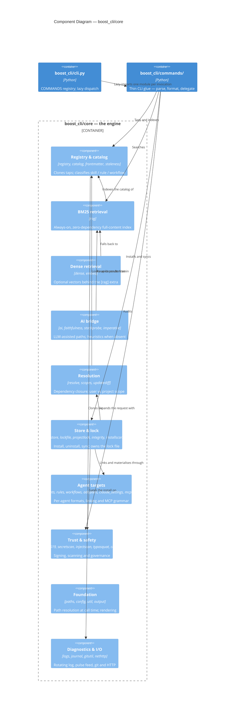

# C4 Level 3 — Components of the core engine

`boost_cli/core/` is the engine: 45 modules that hold all the behaviour. This diagram groups them
into the ten components that actually have distinct responsibilities, and shows the one-way
dependency rule the build enforces.



Every component depends on **Foundation** (`paths`, `config`, `util`, `output`); those arrows are
omitted because drawing ten of them into one box hides the structure rather than showing it.

## The layering rule is enforced, not aspirational

`import-linter` runs in `make lint` and CI, with the contract declared in `pyproject.toml`:

```text
layers = ["cli", "commands", "core"]
```

Higher layers may import lower ones, never the reverse. `core/` must import neither `commands/` nor
`cli`, and `commands/` must not reach up into `cli`. There is exactly one allowlisted exception —
`boost_cli.commands.configuration -> boost_cli.cli` — because `boost completions` reads the
`COMMANDS` registry, which lives in `cli.py` by design. Any other upward import fails the build.

This is why behaviour belongs in `core/` and not in `commands/`: the mutation gate targets
`boost_cli/core` at an 80% kill floor, so logic placed in the command layer is covered by neither
mutation testing nor the layering contract.

## Why retrieval is two components, not one

`rag.py` is the always-on BM25 engine — pure stdlib, full-content index, auto-builds on first
search. It is what the required `eval` gate floors at recall@k ≥ 0.85 over the pinned golden set.

`dense.py` is optional vector retrieval, active only when both the `[rag]` extra and an embeddings
key are present, and falling back to BM25 otherwise. Modelling them as one "search" component would
hide the property that matters most: **the zero-dependency path is the default, and the optional
one can never be a hard requirement.**

The same shape governs the AI bridge. `ai.py` shells out to the `claude` CLI or
`ANTHROPIC_API_KEY` when available and degrades to heuristics when not, so `search --smart`,
`explain` and `distill` get worse without a key, never broken.

## Three item kinds, one scanner

`catalog.scan_dir` walks a tap's clone and classifies every file into one of three kinds:

| Kind | Recognised by | Installable |
|------|---------------|-------------|
| `skill` | `SKILL.md` | yes — copied into the canonical store |
| `rule` | `.mdc`, `.cursorrules`, `.windsurfrules`, `.clinerules` | yes — materialised into each agent's context file |
| `workflow` | Markdown under `commands/`, `agents/`, `workflows/` | yes — rendered per agent, TOML for Gemini |

Per-agent *formats* are pure functions in `core/`: `rules.CONTEXT_FILES` maps an agent with no
rules directory to its context file, and `workflows.TOML_COMMAND_AGENTS` marks the agents whose
slash commands are TOML. Gemini's `commands/` slot is `.toml`
(`workflows.render_gemini_command`) while its `agents/` slot stays verbatim Markdown — getting that
backwards produces a file the agent silently never loads.
