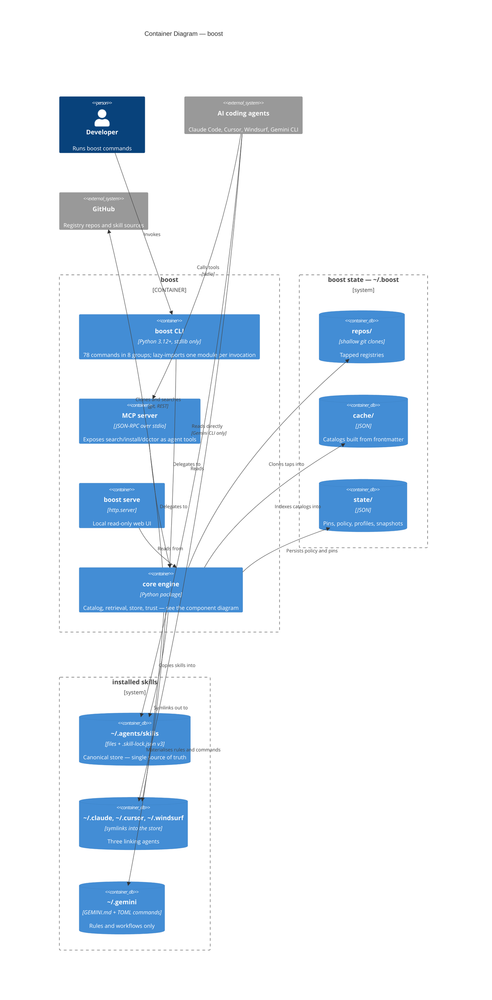

# C4 Level 2 — Containers

The deployable and persistent pieces inside boost. Everything here lives on one machine: boost has
no server side, and every path is resolved at call time from `$HOME` (or `$BOOST_HOME`) by
`core/paths.py`, which is what makes `HOME=<tempdir>` sandboxing work in tests.

## Four agent targets, but only three get symlinks

Gemini CLI implements the Agent Skills standard and discovers `~/.agents/skills` — the canonical
store — *directly*, so it is configured with `links_skills: false`. Linking into `~/.gemini/skills`
as well would put one skill in two of its discovery tiers, where the `.agents` alias out-ranks
whatever was linked, costing a "Skill conflict detected" line per skill per session and buying
nothing.

That distinction is load-bearing for anything you write:

- Iterate `agents.linking_agents()` for anything symlink-shaped — linking, unlinking, stale-link
  sweeps, coverage counts.
- Use `agents.enabled_agents()` for rules and workflows, which materialise into `~/.gemini/` like
  any other agent's dotdir. `agents.native_store_agents()` is the complement, for reporting.

## Why the canonical store exists

One copy of each skill lives in `~/.agents/skills`; every linking agent gets a symlink to it. That
is what makes "install once, available everywhere" true without N copies drifting apart, and it is
why `.skill-lock.json` lives beside the store rather than per-agent. Uninstall removes the copy and
sweeps the links; `boost sync` reconciles reality against the lock.

## The state directory is not the store

`~/.boost` is *derived* data — clones, indexes and preferences that boost can rebuild. `~/.agents`
is *user* data: the skills themselves. Deleting `~/.boost` costs a re-tap and a re-index; deleting
`~/.agents/skills` uninstalls everything. Keeping them apart is deliberate.
