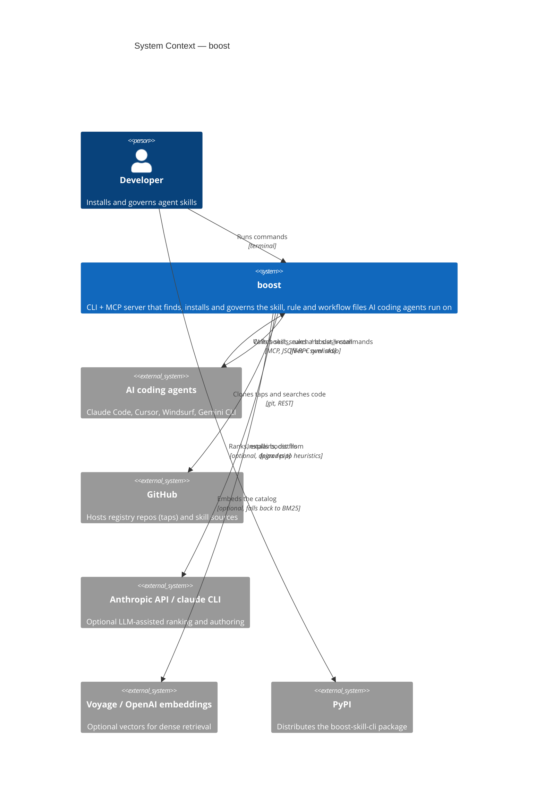

# C4 Level 1 — System context

Who uses boost, and what it talks to. This is the only diagram that shows boost as a single box;
every other diagram in this directory opens that box.

## What the boundaries mean

**boost never requires the network to be useful.** Both external AI services are optional and
degrade rather than fail: `core/ai.py` falls back to heuristics when neither the `claude` CLI nor
`ANTHROPIC_API_KEY` is present, and `core/dense.py` falls back to BM25 when the `[rag]` extra or an
embeddings key is missing. Only tapping and installing genuinely need GitHub.

**The agents are consumers, not integrations.** boost does not drive an agent or run inside one.
It writes files into the locations agents already read, so a skill installed once is visible to
every configured agent with no per-agent wiring — see
[c4-containers.md](c4-containers.md) for where those files land.

**The shipped runtime is stdlib-only.** `[project].dependencies` is empty by design, so the arrow
to PyPI carries a package with no runtime dependency closure of its own. Everything optional lives
behind an extra.
