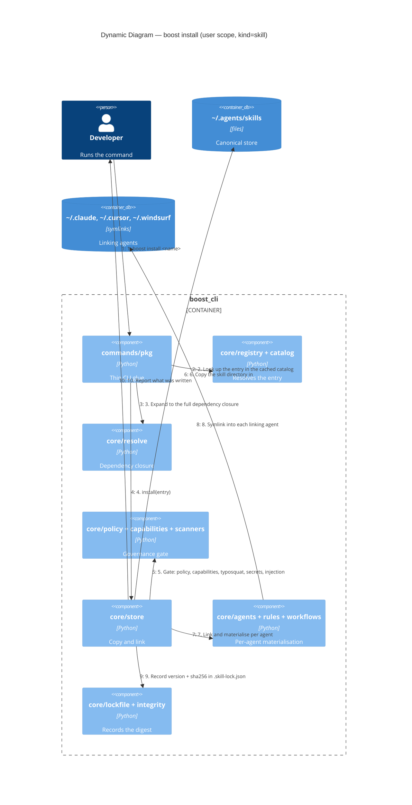

# C4 Dynamic — what `boost install` actually does

The install path is where most of the engine meets. This is the `user`-scope skill case; rules and
workflows branch at step 5 into `_install_rule` / `_install_workflow`, and `project` scope writes
real directories inside the repo instead of symlinking out of the canonical store.

## The parts that are easy to get wrong

**Step 5 fails closed.** The gate raises `BoostError` rather than warning. A skill whose declared
capabilities exceed policy, or that trips the secret / prompt-injection / typosquat scanners, is
not installed at all — there is no "installed but quarantined" state to reason about later.

**Step 7 is not "symlink into every agent".** Only `agents.linking_agents()` get symlinks. Gemini
CLI reads `~/.agents/skills` natively and is deliberately excluded, because linking into
`~/.gemini/skills` too would put one skill in two of its discovery tiers and produce a "Skill
conflict detected" line per skill per session. Rules and workflows *do* materialise into
`~/.gemini/`, so the right helper depends on what you are writing —
see [c4-containers.md](c4-containers.md).

**Step 9 is binding, not advisory.** `core/integrity` makes the recorded digest enforceable, which
is what lets `boost sync` and `boost doctor` tell "the user edited this skill" apart from "the tap
moved underneath it". `core/staleness` is the single source of truth for the second question.

## Where uninstall differs

Uninstall is not the reverse of this diagram. It removes the canonical copy, sweeps every symlink
that pointed at it — including stale links left by an agent that was disabled since install — and
drops the lock entry. Sweeping links for agents that are *not* currently enabled is the part
hand-rolled reversals miss, which is why `store.uninstall` owns it rather than the command layer.
